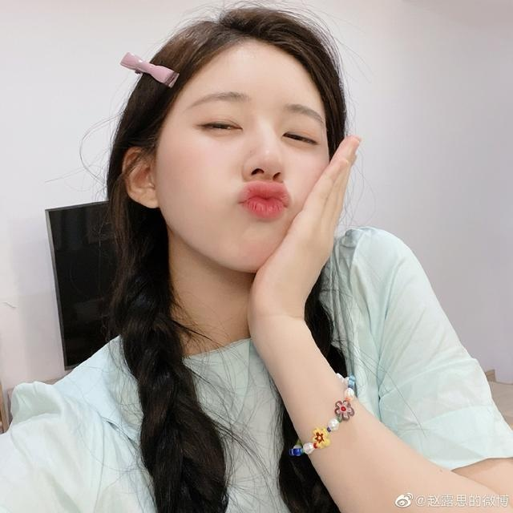

**Face Expression Detection Project**
This project focuses on detecting facial expressions, specifically around the mouth region, to identify one of the following emotions: Neutral, Pouting, Smile, Open Mouth, and Undetectable. Inspired from https://github.com/longpeng2008/yousan.ai.

**Table of Contents**
Installation
Sample Output
Usage
Project Structure
Model Architecture

**Installation**
1.Clone the repository:
git clone https://github.com/boqiny/Face_Expression_Detection.git

2.Navigate to the project directory:
cd Face_Expression_Detection

3.Install required libraries:
pip install -r requirements.txt

**Sample Output**
The output images will have a green rectangle around the mouth region, with a label depicting the detected expression.
Before Processing:

After Processing:

**Usage**
1.Place images you want to test in the input_images folder. Images should be named sequentially starting from 0.jpg.
Here, I use Image-Downloader, which could be found https://github.com/QianyanTech/Image-Downloader.git. I used this open-source tool to collect images from chrome. Detailed usage guide: https://github.com/QianyanTech/Image-Downloader/blob/master/README_zh.md. Note that you have to run data_clean_reformot.py after you collect input images for image preprocessing for training.

2.Run the script:
python3 test_face_expression.py input_images

3.Check the 'output_images' folder for images with facial expressions detected.

**Project Structure**
models/ - Contains pretrained models and facial landmark detectors.
test_face_expression.py - Main script to test the model on new images.
mouth.py - Contains the implementation of the expression detection mechanism.
input_images/ - Place images you want to test here.
output_images/ - Processed images with detected expressions are saved here.

**Model Architecture**
The expression detection relies on a simple 3-layer convolutional neural network (CNN) architecture:

Convolution Layer (3x3 filter, 32 channels, stride 2) with Batch Normalization and ReLU activation.
Convolution Layer (3x3 filter, 64 channels, stride 2) with Batch Normalization and ReLU activation.
Convolution Layer (3x3 filter, 128 channels, stride 2) with Batch Normalization and ReLU activation.
Fully Connected Layer (128x5x5 to 1024).
Fully Connected Layer (1024 to 128).
Output Layer (128 to number of classes).

